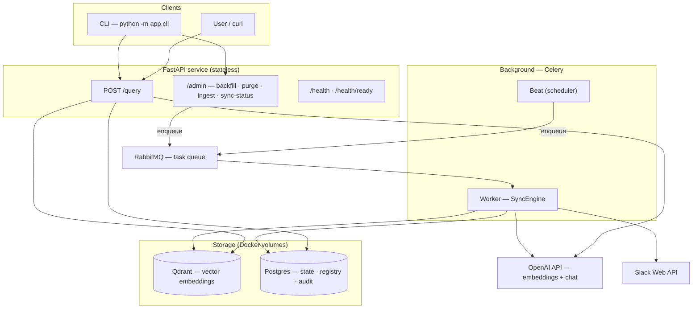
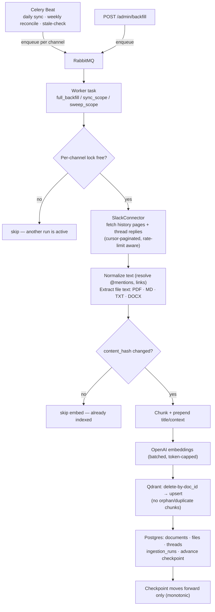
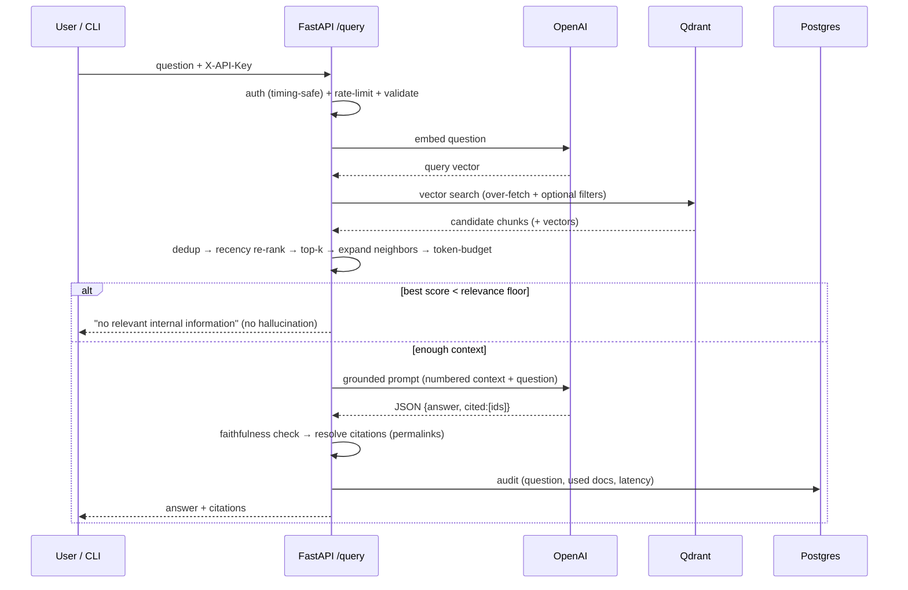

# Kodo Knowledge Agent — Architecture

Detailed diagrams of how the system actually works: components, the Celery ingestion
pipeline, and the query flow. (For the feature list see [`FEATURES.md`](FEATURES.md).)

---

## 1. System components

How the pieces fit together and who talks to whom.

---

## 2. Ingestion pipeline (Celery)

What happens when a channel is (re)synced — triggered by the scheduler or a manual
`/admin/backfill`. Idempotent and resumable.

**Key guarantees:** per-channel lock prevents overlapping runs · `content_hash` skips
unchanged content (saves cost) · delete-then-upsert avoids duplicates · the weekly
reconcile removes messages deleted in Slack.

---

## 3. Query flow (stateless)

Every `/query` is independent — no conversation memory. The agent answers **only** from
retrieved internal context, or refuses.

